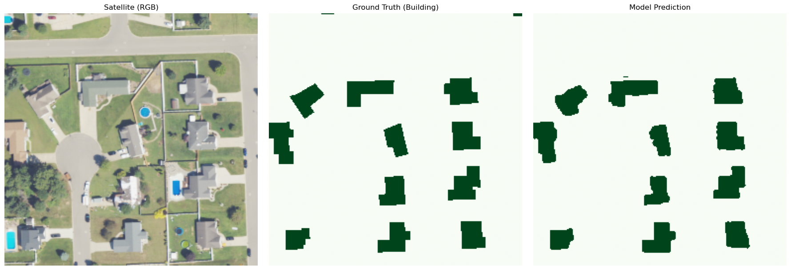
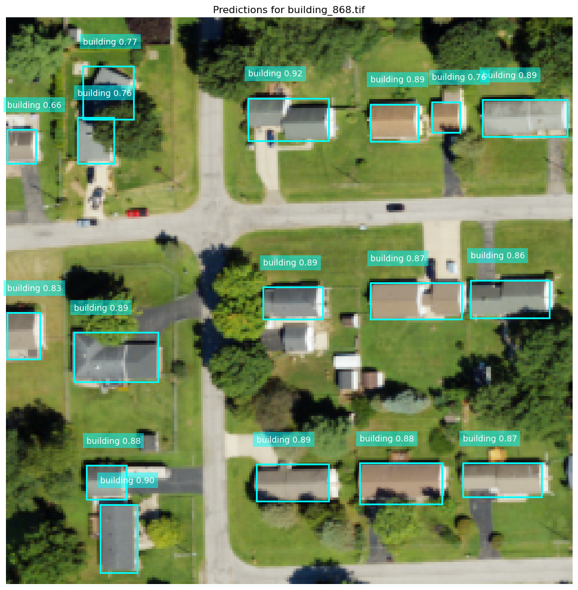

# GeoAI: Automated Feature Extraction for GIS
### Multi-Sensor Semantic Segmentation and Object Detection

## Project Overview
This repository demonstrates advanced Deep Learning applications for extracting spatial features from high-resolution aerial and satellite imagery. As a Geomatics Engineer, I developed these specialized pipelines to bridge the gap between raw spectral rasters and GIS-ready vector data, specifically targeting agricultural monitoring and automated urban mapping.

---

## Section 1: Semantic Segmentation (U-Net)
Goal: Pixel-level classification for precise area calculation and high-fidelity boundary extraction.

### 1. Building Footprint Extraction (NAIP)
* **Sensor Input:** NAIP high-resolution imagery(256*256 patches).
* **Spectral Configuration:** Leveraged 4-channel input (RGB + Near-Infrared) to better distinguish between roofing materials and complex urban shadows.
* **Architecture:** Custom U-Net featuring Batch Normalization and Dropout layers for robust spatial generalization.
* **Training Workflow:** Utilized a 70/20/10 split on 1,748 image-mask pairs, optimized with Adam and a hybrid BCE + Dice Loss to handle class imbalance as well as ReduceLROnPlateau and EarlyStopping to ensure optimal convergence.
* **Results:** Achieved a validation IoU of 0.88 utilizing a hybrid loss function to produce cleaner geometric boundaries.
* 

### 2. Cotton Crop Identification (Sentinel-2)
* **Sensor Input:** Sentinel-2 multi-spectral satellite imagery(256*256 patches).
* **Spectral Configuration:** Leveraged 4-channel input (Red, Green, Blue + Near-Infrared) to isolate specific vegetation reflectance signatures from soil backgrounds.
* **Architecture:** Custom U-Net featuring Batch Normalization and Dropout layers for robust spatial generalization.
* **Training Workflow:** Developed on a dataset of 1,597 image-mask pairs using a systematic 70/20/10 split. The pipeline utilized Adam optimization with ReduceLROnPlateau and EarlyStopping to ensure optimal convergence.
* **Results:** Achieved a validation IoU of 0.93, utilizing a hybrid loss function to maintain high sensitivity in detecting narrow field boundaries and irregular crop patches.

---

## Section 2: Object Detection (YOLOv8)
Goal: Rapid localization and feature counting across large geographic areas.

### 1. Building Localization and Vector Export (NAIP)
* **Model Architecture:** YOLOv8 (Ultralytics) utilizing a CSPDarknet53 backbone and an anchor-free de-coupled head. This separates classification and bounding box regression branches to improve localization precision for dense urban structures.
* **Spectral Configuration:** Optimized for 3-channel NAIP imagery (RGB) to improve detection confidence in complex residential environments.
* **Optimization Strategy:** Trained for 50 epochs using Complete IoU (CIoU) and Distribution Focal Loss (DFL) to refine box boundaries and Varifocal Loss (VFL) for classification confidence.
* **GIS Integration:** Automated coordinate transformation logic maps relative pixel detections to geographic coordinates, exporting results as GeoJSON with accurate CRS (Coordinate Reference System) metadata for immediate use in ArcGIS Pro or QGIS.
* **Results:** The model achieved exceptional detection and localization metrics:
    * **mAP50:** 0.961 (Superior detection accuracy).
    * **mAP50-95:** 0.8 (High precision in bounding box boundary alignment).
    * **Precision/Recall:** 0.952 / 0.929.

---

## Technical Methodology
* **Spatial Analysis:** All models are designed to preserve spatial metadata, ensuring that AI predictions can be overlaid onto existing GIS layers without displacement.
* **Pre-processing:** implemented channel-wise Min-Max scaling and 4-band spectral stacking to maximize the informational gain from infrared bands.
* **Validation:** Included visualization functions to export model predictions as high-resolution PNGs for qualitative accuracy assessment and reporting.

---

## Tech Stack
* **Deep Learning:** TensorFlow, Keras, PyTorch (Ultralytics).
* **Geospatial Processing:** GDAL, Rasterio, GeoPandas, Shapely, Fiona.
* **Visualization:** Matplotlib, OpenCV, Folium.

---

## Repository Structure
* `Building_Segmentation_Sandeep.ipynb`: U-Net workflow for high-res building footprint extraction.
* `Cotton_Segmentation_Sandeep.ipynb`: U-Net workflow for 4-channel agricultural identification.
* `Building_Detection_using_Yolo.ipynb`: YOLOv8 implementation utilizing RGB bands of imagery
* `results/`: Folder containing model performance metrics, validation plots, and prediction samples.

---
**Contact:** [Sandeep Gautam] – [gtmsandeep2@gmail.com]
